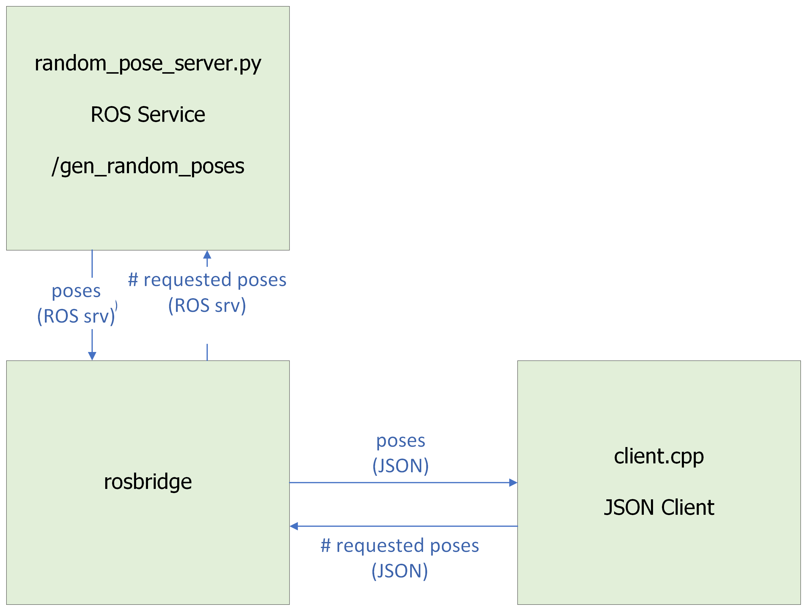

# rosbridge_demo
A demonstration of basic rosbridge and rostful functionality in a ROS system.

As shown in the diagram, rosbridge exposes a JSON interface to a ROS service,
while rostful presents a REST interface via an HTTP interface.

## Sample node

The ROS package `ros_pose_gen` contains a server (written in Python) which
provides a set of sample ROS topics and services, which can then be accessed
either through rosbridge or rostful.

 `/gen_random_poses` generates a requested number of 6DOF poses

## Access via rosbridge

Rosbridge converts ROS messages to a JSON format, and expose those results
on a websocket, with a schema like

```JSON
{ 
  "op": "call_service", 
  "service": "/gen_random_pose", 
  "args": [2]
}
```

that is [well-documented](https://github.com/RobotWebTools/rosbridge_suite/blob/ros1/ROSBRIDGE_PROTOCOL.md). Because it is documented, actively maintained, and automically configured, it is a potentially scalable choice for ROS JSON API needs. 




The directory `cpp_client` contains a C++ client which interacts with the
rosbridge interface in "raw JSON."

The directory `roslibpy_client` uses [roslibpy](https://roslibpy.readthedocs.io/en/latest/index.html), which must be installed.  **Note:** that `roslibpy` **does not** require ROS to be installed (that's the magic of rosbridge), you should be able to install it on any computer
using `pip`.


---
# Installation and Usage

## Docker (Recommended)

This demo can be run in Docker containers, which greatly simplifies installation. Docker is supported on Windows, Mac, and many flavors of Linux including Windows Subsystem for Linux. I uploaded images on Docker Hub that you can download with the following commands.
1. Install Docker Engine by following the official [instructions](https://docs.docker.com/engine/install/).
2. Download and run the `rosbridge_demo_ros` container. This container:
    * provides a ROS service that generates a list of random poses
    * starts a rosbridge server on port 9090
    * starts a rostful server on port 8080

    ```
    docker run -it -p 8080:8080 -p 9090:9090 playertr/rosbridge_demo_ros roslaunch ros_pose_gen pose_server.launch
    ```

    or

    ```
    make run-ros-image
    ```

1. Download and run the `rosbridge_demo_cpp` container. This container:
    * connects to the rosbridge websocket
    * requests two (from argument) random poses and prints the response
    ```
    docker run -it --net=host playertr/rosbridge_demo_client build/client 2
    ```

1. Install roslibpy and run the python client directly (on any computer):

    ```
    pip install roslibpy
    roslibpy_client/roslibpy_client.py
    ```

1. Access the rostful interface using your web browser:

    ```
    http://localhost:8080/chatter
    ```

    (still working on a demo for the service call)

    Rostful publishes some meta-information at particular URLs:

    ```
    http://localhost:8080/_rosdef
    ```

## Source
If you aren't using Docker, then you can still install all the dependencies locally in an Ubuntu machine. Here's a sketch of how to do that. For more detail, refer to the Docker installation scripts in `docker/Dockerfile_ros` and `docker/Dockerfile_cpp` and to the referenced instructions.
1. Install ROS (Melodic, which requires Ubuntu 18.04, has been tested) by following the [official instructions](http://wiki.ros.org/melodic/Installation/Ubuntu).
2. Install the `ros_pose_gen` package in a catkin workspace. This package provides a ROS service that generates a list of random poses.
3. Install rosbridge by following the [official instructions](http://wiki.ros.org/rosbridge_suite).
4. Install Microsoft's C++ REST SDK by following the official instructions in its Github [README](https://github.com/microsoft/cpprestsdk).
4. Install C++ build tools:
    ```
    sudo apt-get update
    sudo apt-get install build-essential cmake
    ```
5. Build the C++ client executable. This executable, which is installed to `cpp_client/build/main`, connects to a rosbridge server at `0.0.0.0:9090` and issues a service call to the ROS service.
    ```
    mkdir -p cpp_client/build
    cd cpp_client/build
    cmake ..
    make
    ```
6. Run the demo:
    * Terminal one:
        ```
        source devel/setup.bash
        roslaunch ros_pose_gen pose_server.launch
        ```
    * Terminal two:
        ```
        ./cpp_client/build/client
        ```

---
## Applicable Documentation

Service/Message definitions http://wiki.ros.org/ROS/Tutorials/CreatingMsgAndSrv 

ROS Service Tutorial http://wiki.ros.org/ROS/Tutorials/WritingServiceClient%28python%29

How to create a ROS package http://wiki.ros.org/ROS/Tutorials/CreatingPackage

rosbridge docs http://wiki.ros.org/rosbridge_suite

variable-length ROS messages http://wiki.ros.org/msg

ROS pose message http://docs.ros.org/en/noetic/api/geometry_msgs/html/msg/Pose.html

ROS msg capitalization conventions http://wiki.ros.org/ROS/Patterns/Conventions

Running rosbridge tutorial http://wiki.ros.org/rosbridge_suite/Tutorials/RunningRosbridge

rosbridge Protocol Specification https://github.com/RobotWebTools/rosbridge_suite/blob/ros1/ROSBRIDGE_PROTOCOL.md

Microsoft C++ REST SDK https://stackoverflow.com/questions/34423092/websocket-library
https://github.com/Microsoft/cpprestsdk


---
## (Re-)Building the docker images

Rules for rebuilding the Dockerfile are in the [Makefile](Makefile) as the root
of this repo.   The docker images can be rebuilt by running:

```
make images
```

The individual image can be built by:

```
make build-ros-image
make build-client-image
```
